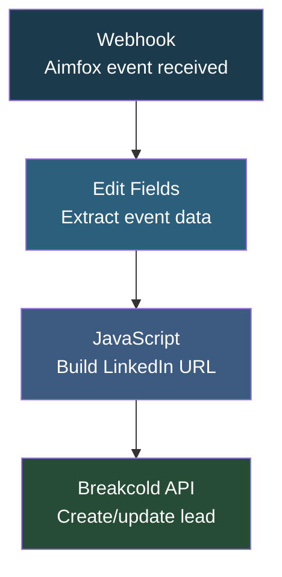

# Aimfox Webhooks to Breakcold

## Overview

This automation **syncs LinkedIn engagement data from Aimfox to Breakcold CRM in real time**. When a prospect replies to your LinkedIn outreach via Aimfox, this workflow automatically captures the reply details and creates or updates the lead in Breakcold with their name, email, LinkedIn URL, and campaign context. This keeps your CRM up to date without any manual data entry.

## How It Works

```
Aimfox Webhook -> Extract Fields -> Build LinkedIn URL -> Push to Breakcold
```

### Workflow Diagram



### Workflow Steps

1. **Webhook** - Receives POST events from Aimfox (replies, connections, messages).
2. **Edit Fields** - Extracts key data: event type, campaign name, flow type, message content, prospect's public identifier, first name, last name, and email.
3. **Code (Build LinkedIn URL)** - Constructs the full LinkedIn profile URL from the public identifier.
4. **Breakcold API** - Creates a new lead in Breakcold with LinkedIn URL, email, name, and auto-assigns an owner. If the company doesn't exist, it creates one automatically.

## Nodes

| Node | Type |
|------|------|
| Webhook | Webhook Trigger (POST) |
| Edit Fields | Set Fields |
| Code in JavaScript | JavaScript Code |
| Breakcold connection2 | HTTP Request (Breakcold API) |

## Integrations

- **Aimfox** - Source of LinkedIn engagement events via webhook
- **Breakcold** - CRM where leads are created/updated

## Setup

1. Import `aimfox_webhooks_to_breakcold.json` into your n8n instance.
2. Update the Breakcold API key in the HTTP Request node.
3. Configure the Aimfox webhook to point to this workflow's webhook URL.
4. Update the Breakcold status ID if using different pipeline stages.
5. Activate the workflow.
